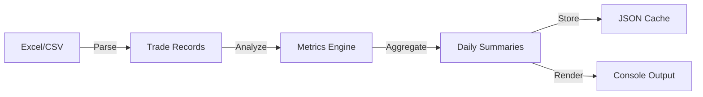

# TraderRank - Trading Analytics System

## Mission Statement

TraderRank processes trading data to provide performance analytics and insights. Built with Rust for reliability and performance, this system offers comprehensive trading metrics and analysis.

## Architecture Philosophy

**Core Principles:**

1. **Data Integrity** - Accurate processing of all trades
2. **Performance** - Fast processing and real-time analysis
3. **Clarity** - Clear presentation of analytics

## System Design

### Core Modules

```
TraderRank/
├── src/
│   ├── main.rs           // Application orchestrator
│   ├── models/           // Domain models & data structures
│   │   ├── mod.rs
│   │   ├── trade.rs      // Trade entity with full lifecycle
│   │   └── summary.rs    // Daily/aggregate summaries
│   ├── parser/           // Data ingestion layer
│   │   ├── mod.rs
│   │   └── csv_parser.rs // CSV/Excel parsing with validation
│   ├── analytics/        // Quantitative engine
│   │   ├── mod.rs
│   │   ├── metrics.rs    // Core trading metrics
│   │   └── patterns.rs   // Pattern recognition & time analysis
│   ├── persistence/      // Data persistence layer
│   │   ├── mod.rs
│   │   └── json_store.rs // JSON storage with compression
│   └── visualization/    // Presentation layer
│       ├── mod.rs
│       ├── tables.rs     // Beautiful ASCII tables
│       └── charts.rs     // Terminal-based charts
```

### Data Flow



## Key Features

### Trading Metrics
- **P&L Analysis**: Real-time profit/loss tracking with commission accounting
- **Win Rate**: Statistical edge calculation with confidence intervals
- **Trade Distribution**: Volume analysis by time, symbol, and strategy
- **Risk Metrics**: Maximum drawdown, Sharpe ratio, risk-adjusted returns

### Time Analysis
- **Intraday Patterns**: Identifies your golden hours
- **Market Session Analysis**: Pre-market, regular, after-hours performance
- **Temporal Clustering**: Discovers recurring profitable patterns

### Data Management
- **Incremental Processing**: Only processes new trades
- **Smart Caching**: Lightning-fast historical queries
- **Data Validation**: Detects and handles anomalies

## Usage Patterns

### Quick Start
```bash
# Process all new trades and display last 10 days
cargo run

# Force reprocess all data
cargo run -- --reprocess

# Custom date range
cargo run -- --days 30
```

### Extension Points

**Adding New Metrics:**
```rust
// In analytics/metrics.rs
impl TradingMetrics {
    pub fn your_custom_metric(&self) -> f64 {
        // Your quantitative magic here
    }
}
```

**Custom Data Sources:**
```rust
// Implement the DataSource trait
trait DataSource {
    fn read_trades(&self) -> Result<Vec<Trade>>;
}
```

## Code Standards

### Type Safety First
- Use `rust_decimal::Decimal` for all financial calculations
- Never use `f32/f64` for money
- Leverage Rust's type system for domain modeling

### Error Handling
```rust
// Always use Result types with context
let trades = parse_csv(&path)
    .context("Failed to parse trading data")?;
```

### Performance Guidelines
- Process trades in streaming fashion when possible
- Use iterators over collections
- Parallelize independent calculations with `rayon`

## Development Workflow

### Testing
```bash
# Run all tests with coverage
cargo test --all-features

# Benchmark performance
cargo bench
```

### Adding Features
1. Design the data model first
2. Write tests for edge cases
3. Implement with clarity > cleverness
4. Document with examples

## Sample Output

```
╔════════════════════════════════════════════════════════════╗
║                   TraderRank Analytics                      ║
║                    2024-01-15 Summary                       ║
╠════════════════════════════════════════════════════════════╣
║ Realized P&L:        $12,456.78  ▲                         ║
║ Win Rate:            68.5% (41W/19L)                       ║
║ Avg Winner:          $456.12                               ║
║ Avg Loser:          -$123.45                               ║
║ Best Time:           09:30-10:30 (42% of profits)          ║
║ Risk-Adjusted:       2.34 Sharpe                           ║
╚════════════════════════════════════════════════════════════╝

Intraday Performance:
    $800 ┤     ╭─╮
    $600 ┤   ╭─╯ ╰╮
    $400 ┤  ╱     ╰─╮
    $200 ┤╭╯        ╰╮
      $0 ┼───────────╯────
         └─┬──┬──┬──┬──┬─
          9  10 11 12  1
```

## Performance Targets

- Parse 100K trades: < 100ms
- Calculate all metrics: < 50ms
- Render full report: < 10ms
- Memory footprint: < 50MB for 1M trades

## Future Enhancements

- [ ] Real-time trade streaming
- [ ] Machine learning pattern detection
- [ ] Multi-strategy segregation
- [ ] Risk-adjusted position sizing
- [ ] Monte Carlo simulations
- [ ] Integration with broker APIs

## Notes for Contributors

This codebase values:
- **Correctness** over speed (but we're still blazing fast)
- **Readability** over cleverness
- **Tests** over documentation (but we have both)
- **Types** over runtime checks

---

Built with Rust