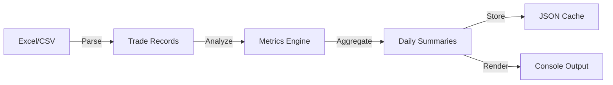

# TraderRank - Trading Analytics System

## Mission Statement

TraderRank processes trading data to provide performance analytics and insights. Built with Rust for reliability and performance, this system offers comprehensive trading metrics and analysis.

## Architecture Philosophy

**Core Principles:**

1. **Data Integrity** - Accurate processing of all trades
2. **Performance** - Fast processing and real-time analysis
3. **Clarity** - Clear presentation of analytics

## System Design

### Core Modules

```
TraderRank/
├── src/
│   ├── main.rs           // Application orchestrator
│   ├── models/           // Domain models & data structures
│   │   ├── mod.rs
│   │   ├── trade.rs      // Trade entity with buy/sell sides
│   │   └── summary.rs    // Daily/weekly/overall summaries
│   ├── parser/           // Data ingestion layer
│   │   ├── mod.rs
│   │   └── csv_parser.rs // CSV parsing with validation
│   ├── analytics/        // Quantitative engine
│   │   ├── mod.rs
│   │   ├── metrics.rs    // Core metrics & position management
│   │   └── patterns.rs   // Time-based pattern analysis
│   ├── persistence/      // Data persistence layer
│   │   ├── mod.rs
│   │   └── json_store.rs // JSON storage with file tracking
│   └── visualization/    // Presentation layer
│       ├── mod.rs
│       ├── tables.rs     // Summary tables (detailed/brief)
│       ├── charts.rs     // P&L, win rate, commission charts
│       ├── calendar.rs   // Monthly calendar views
│       └── weekly.rs     // Weekly performance analysis
```

### Data Flow



## Key Features

### Trading Metrics
- **P&L Analysis**: Real-time profit/loss tracking with comprehensive commission accounting
- **Win Rate**: Detailed win/loss tracking across all timeframes (hourly, daily, weekly)
- **Trade Distribution**: Volume analysis by time periods and market sessions
- **Position Management**: Sophisticated long/short position tracking with proper P&L calculation

### Time Analysis
- **Intraday Patterns**: Identifies your golden hours with session-based analysis
- **Market Session Analysis**: Detailed breakdown by pre-market, market open, lunch, power hour
- **Multi-timeframe Views**: Hourly, daily, weekly performance tracking
- **Calendar Visualization**: Monthly calendar heatmaps comparing net vs gross P&L

### Data Management
- **Incremental Processing**: Smart file tracking to only process new trades
- **JSON Caching**: Persistent storage with automatic backup and recovery
- **Duplicate Detection**: Automatic filtering of duplicate trades across files
- **File Management**: Tracks processed files to avoid reprocessing

## Usage Patterns

### Quick Start
```bash
# Process all new trades and display last 10 days
cargo run

# Force reprocess all data
cargo run -- --reprocess

# Custom date range
cargo run -- --days 30
```

### Extension Points

**Adding New Metrics:**
```rust
// In analytics/metrics.rs
impl TradingAnalytics {
    // Add new analysis methods alongside existing ones
    pub fn your_custom_metric(trades: &[Trade]) -> f64 {
        // Your quantitative analysis here
    }
}
```

**Custom Data Sources:**
```rust
// Implement the DataSource trait
trait DataSource {
    fn read_trades(&self) -> Result<Vec<Trade>>;
}
```

## Code Standards

### Type Safety First
- Use `rust_decimal::Decimal` for all financial calculations
- Never use `f32/f64` for money
- Leverage Rust's type system for domain modeling

### Error Handling
```rust
// Always use Result types with context
let trades = parse_csv(&path)
    .context("Failed to parse trading data")?;
```

### Performance Guidelines
- Process trades in streaming fashion when possible
- Use iterators over collections
- Parallelize independent calculations with `rayon`

### Terminal Output Formatting with Colors
**CRITICAL**: When using the `colored` crate for terminal output alignment:

The `colored` crate adds ANSI escape codes that are invisible but affect string length calculations. This breaks alignment when using format specifiers like `{:>10}` or `{:^8}`.

**❌ WRONG - Breaks alignment:**
```rust
println!("{:>10}", value.to_string().green());  // Color codes counted in width
println!("{:^8}", format!("${}", amount).red()); // Misaligned in tables
```

**✅ CORRECT - Preserves alignment:**
```rust
// Apply formatting BEFORE coloring
println!("{}", format!("{:>10}", value).green());

// For complex cases, format first, then color
let formatted = format!("{:>10}", value);
let colored = formatted.green();
println!("{}", colored);
```

**Examples in codebase:**
- `charts.rs`: Bar charts format width before coloring
- `tables.rs`: Right-align values before applying color
- `calendar.rs`: Center-align P&L values before coloring
- `weekly.rs`: Format column widths before color application

This ensures all tables, charts, and calendars maintain proper column alignment regardless of terminal colors.

## Development Workflow

### Testing
```bash
# Run all tests with coverage
cargo test --all-features

# Benchmark performance
cargo bench
```

### Adding Features
1. Design the data model first
2. Write tests for edge cases
3. Implement with clarity > cleverness
4. Document with examples

## Sample Output

```
══════ Overall Trading Summary ══════
├─ Total Net P&L: $12,456.78 (Gross: $13,456.78, Commissions: -$1,000.00)
├─ Win Rate: 68.5% (856/1250 trades)
├─ Average Win: $45.67
├─ Average Loss: -$23.45
├─ Best Day: 2024-01-15 ($2,456.78)
└─ Worst Day: 2024-01-13 (-$567.89)

📊 Daily P&L Chart:
    $3000 ┤      ╭─╮
    $2000 ┤   ╭──╯ ╰╮
    $1000 ┤  ╱      ╰─╮
       $0 ┼─╯         ╰───
   -$1000 ┤
          └────────────────

📅 January 2024 - Net P&L         📅 January 2024 - Gross P&L
│ Mon  │ Tue  │ Wed  │ Thu  │ Fri  ││ Mon  │ Tue  │ Wed  │ Thu  │ Fri  │
│      │   1  │   2  │   3  │   4  ││      │   1  │   2  │   3  │   4  │
│      │ $234 │-$567 │ $890 │$1234 ││      │ $244 │-$557 │ $900 │$1244 │

🎯 Best Trading Periods:
🥇 Market Open (09:00-10:00): $5,234.56 | Win Rate: 72.3%
🥈 Power Hour (15:00-16:00): $3,456.78 | Win Rate: 68.9%
🥉 Lunch Hour (12:00-13:00): $2,345.67 | Win Rate: 65.4%
```

## Current Features

### Implemented
- ✅ Comprehensive P&L tracking (net and gross)
- ✅ Commission impact analysis
- ✅ Multi-timeframe analysis (hourly, daily, weekly)
- ✅ Calendar visualizations
- ✅ Position management with trade matching
- ✅ Market session analysis
- ✅ Incremental file processing
- ✅ Duplicate trade detection

## Future Enhancements

### Near-term
- [ ] Risk metrics (Sharpe ratio, maximum drawdown)
- [ ] Performance benchmarking
- [ ] Unit test coverage
- [ ] Command-line arguments for custom analysis

### Long-term
- [ ] Real-time trade streaming
- [ ] Machine learning pattern detection
- [ ] Multi-strategy segregation
- [ ] Risk-adjusted position sizing
- [ ] Monte Carlo simulations
- [ ] Integration with broker APIs

## Notes for Contributors

This codebase values:
- **Correctness** over speed (but we're still blazing fast)
- **Readability** over cleverness
- **Tests** over documentation (but we have both)
- **Types** over runtime checks

---

Built with Rust